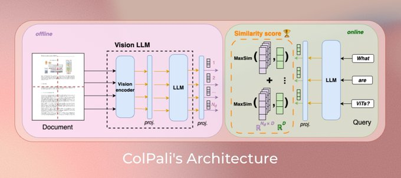

# VisionRAG

VisionRAG is an implementation of   MULTI-MODALITY-RAG which uses the new  novel approach [ColPali: Efficient Document Retrieval with Vision Language Models](https://arxiv.org/abs/2407.01449) 

## Overview of ColPali Paper:
* Direct embedding of document screenshots
* No need for OCR or complex preprocessing
* Handles multi-modal content (text, images, charts, tables)
* Streamlined retrieval and ranking process
* Built on ColPali 2's efficient embedding technique

This project aims to demonstrate how visual-based embedding can simplify and enhance RAG systems, making them more versatile and easier to implement for a wide range of document types.

