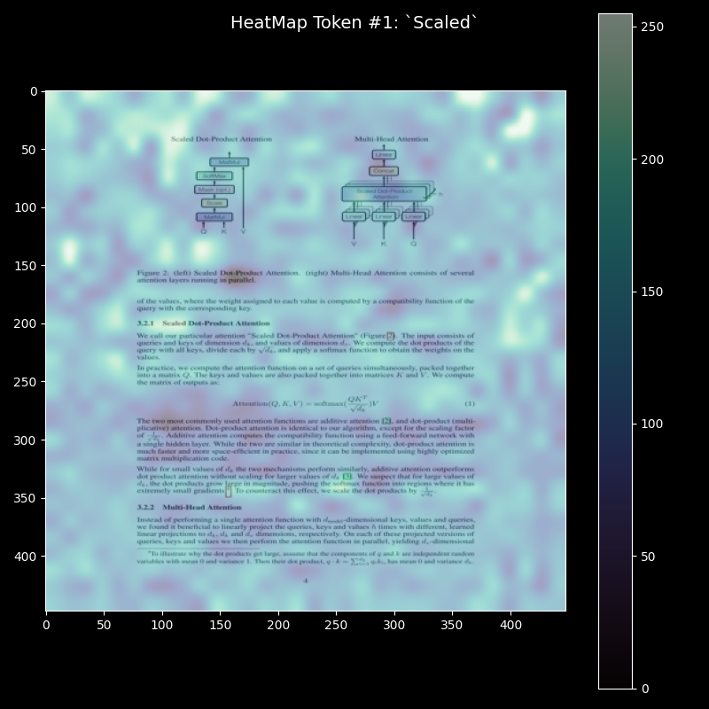
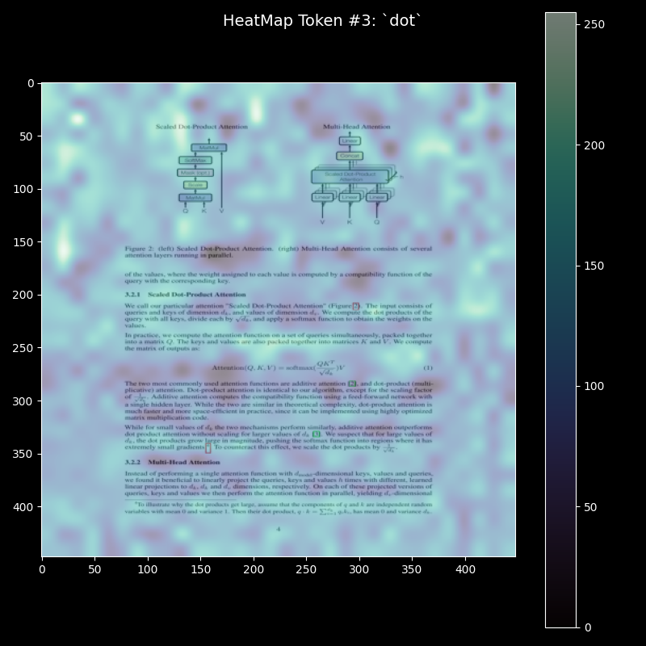
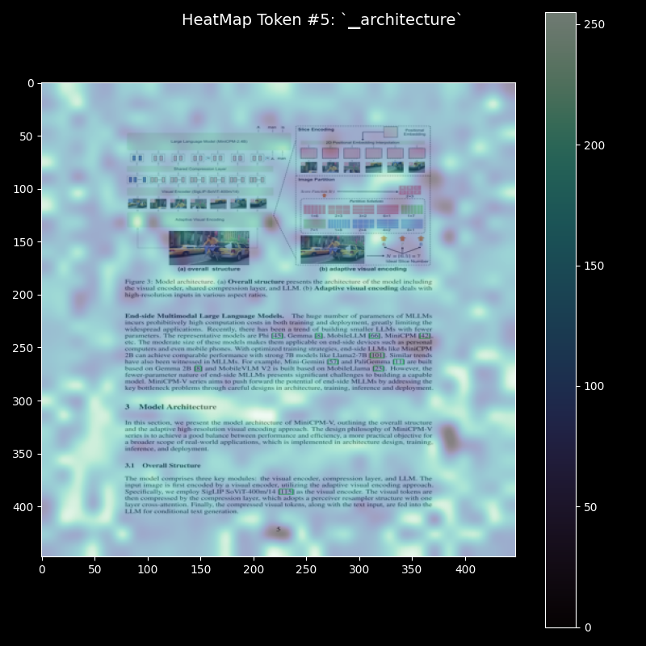
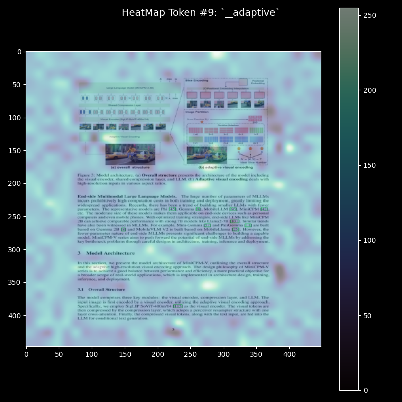

# VisionRAG

VisionRAG is an innovative implementation of MULTI-MODALITY-RAG, leveraging the novel approach introduced in [ColPali: Efficient Document Retrieval with Vision Language Models](https://arxiv.org/abs/2407.01449).

  

## 🔍 Overview!

ColPali offers a groundbreaking method for document retrieval using vision language models. This project aims to demonstrate how visual-based embedding can simplify and enhance RAG systems, making them more versatile and easier to implement for a wide range of document types.

### Key Features of ColPali:

- Direct embedding of document screenshots
- No need for OCR or complex preprocessing
- Handles multi-modal content (text, images, charts, tables)
- Streamlined retrieval and ranking process
- Built on ColPali 2's efficient embedding technique

### How fast is the indexing? 
We tested the speed of the indexing on affordable GPUs , we pass the embeddings into GPUs 
| GPU          | Batch Size | Speed (s/iteration) |
|--------------|-------------|---------------------|
| NVIDIA A10g  | 4           | 2.67                |
| NVIDIA l4    | 4           | 3.6s                |
| NVIDIA t4    | 4           | 4.55                |

### Interpretability 
| Query          | Images |  
|--------------|-------------|
| Scaled  |

|
| Dot    |

 |
| what is the model architecture and what is adaptive visual encoding?  |

 |
| what is the model architecture and what is adaptive visual encoding?  |

 |

## 📚 Resources

For more information about this innovative approach:

- [ColPali GitHub Repository](https://github.com/illuin-tech/colpali)
- [ColPali on Hugging Face](https://huggingface.co/vidore/colpali)
- [Colpali Blog](https://blog.vespa.ai/retrieval-with-vision-language-models-colpali/)

## 🎯 Project Goals

1. Implement a multi-modal RAG system using ColPali's approach
2. Demonstrate the efficiency and versatility of this approach 

## 🚀 Getting Started

